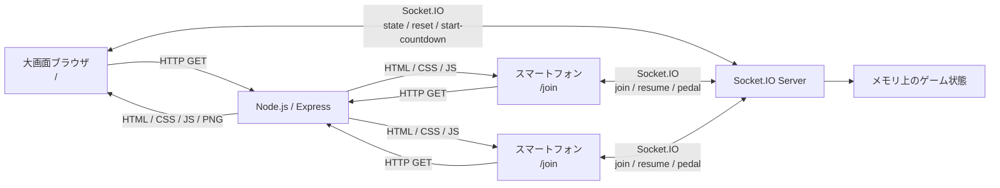

# QR Bike Race

大画面にQRコードを表示し、スマートフォンから最大5人が参加して遊ぶカジュアル自転車レースです。

## ローカル起動

```bash
npm install
npm start
```

大画面用:

```text
http://localhost:3000/
```

スマートフォン用:

```text
http://localhost:3000/join
```

スマートフォン実機でローカル確認する場合は、PCとスマートフォンを同じWi-Fiに接続し、`localhost` ではなくPCのLAN IPアドレスで大画面を開いてください。

## ルール

- 大画面のQRコードを読むとスマートフォンで参加画面が開きます。
- 名前は4文字までです。
- 5人が参加できます。
- スマートフォンの `L` / `R` ボタンを交互に押すと進みます。
- 全員がスタートラインに着くと `5` からカウントダウンし、`スタート！` でレース開始です。
- 最初にゴールへ到達したプレイヤーが勝者として中央に表示され、紙吹雪が舞います。

## スマートフォン表示

参加画面はPWA対応にしています。スマートフォンのブラウザでURLバーをできるだけ隠したい場合は、参加画面をホーム画面に追加して起動してください。通常のブラウザタブでは、OSやブラウザの制約によりURLバーを完全には消せない場合があります。

## 開発者向け情報

このアプリは Node.js の単一プロセスで、画面配信とリアルタイム同期をまとめて扱います。大画面側とスマートフォン側は同じ Express サーバーから配信され、操作同期には Socket.IO を使います。

### 技術構成

- `server.js`: Express サーバー、Socket.IO サーバー、ゲーム状態管理
- `public/index.html`: 大画面レース画面
- `public/screen.js`: 大画面の描画、QRコードURL設定、リセット/カウント開始操作
- `public/join.html`: スマートフォン参加画面
- `public/join.js`: 名前入力、L/Rボタン操作、再接続処理、フルスクリーン要求
- `public/styles.css`: 大画面とスマートフォン画面の共通スタイル
- `public/assets/`: 自転車スプライト画像
- `public/manifest.webmanifest`: スマートフォンのPWA表示用manifest
- `render.yaml`: Render Web Service 用設定

### 構成図



### 通信方式

初期表示はHTTPで配信します。`/` は大画面、`/join` はスマートフォン操作画面です。大画面のQRコードは `/qr.svg?url=...` で生成され、現在開いているホストの `/join` を指します。

リアルタイム通信は Socket.IO です。Render などのWeb Service上では、Socket.IO が利用可能なWebSocketへアップグレードし、必要に応じてpollingも使います。

### Socket.IO イベント

クライアントからサーバー:

- `join`: 名前と端末IDを送信して参加します。
- `resume`: スマートフォン更新後に、保存済み端末IDで同じプレイヤーとして復帰します。
- `pedal`: `left` / `right` を交互に送信して自転車を進めます。
- `start-countdown`: 大画面の「カウント開始」ボタンから、少人数でもカウントを開始します。
- `reset`: 大画面の「リセット」ボタンからゲームを初期化します。

サーバーからクライアント:

- `state`: 現在のゲーム状態を全クライアントへ配信します。
- `reset-game`: リセット時にスマートフォン側の保存済み参加情報を消します。

### ゲーム状態

ゲーム状態はサーバーのメモリ上に保持されます。永続化はしていないため、サーバーが再起動するとレース状態は初期化されます。

主な状態:

- `phase`: `lobby` / `staging` / `countdown` / `racing` / `finished`
- `players`: 参加者一覧
- `countdown`: カウントダウン表示
- `winnerId`: 勝者のプレイヤーID

参加者ごとの主な情報:

- `id`: 端末ごとのプレイヤーID
- `name`: 4文字までの表示名
- `lane`: レーン番号
- `colorKey`: `red` / `blue` / `green` / `yellow` / `black`
- `approach`: スタートラインまでの進行度
- `distance`: レース開始後の進行度
- `lastButton`: 直前に押したボタン。L/R交互押し判定に使います。

### 開発メモ

- 進行速度は `server.js` の `START_STEP` と `RACE_STEP` で調整します。
- 最大参加人数は `server.js` の `MAX_PLAYERS` で調整します。
- 大画面上の自転車位置は `public/screen.js` の `WAIT_X`、`START_X`、`GOAL_X` と、`public/styles.css` の `.rider` の幅・アンカーで調整します。
- スマートフォンのボタンは `click` ではなく `pointerdown` で処理し、タップ直後にサーバーへ送信します。
- Render Free では無通信時にスリープするため、イベント直前に一度大画面URLへアクセスして起こしておくと安定します。

## 無料デプロイ

Render の Free Web Service で動かせます。Socket.IO を使うため、Static Site ではなく Web Service として作成してください。

設定例:

- Build Command: `npm install`
- Start Command: `npm start`
- Plan: `Free`

このリポジトリには Render Blueprint 用の `render.yaml` も含めています。

## Renderで不安定なとき

次の症状がある場合は、Static Site として作られている可能性が高いです。

- `/join` を更新すると Not Found になる
- `/socket.io/socket.io.js` が 404 になる
- スマートフォン操作が大画面に反映されない

Render Dashboard でサービス種別が `Web Service`、Runtime が `Node` になっていることを確認してください。Static Site ではこのゲームは動きません。

Web Service 側の設定:

- Health Check Path: `/healthz`
- Build Command: `npm install`
- Start Command: `npm start`
